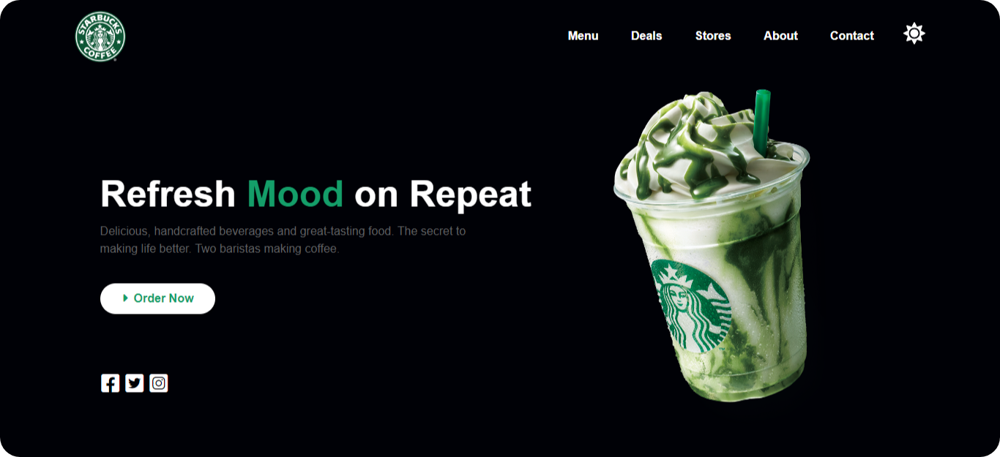

<div align="center">
  
  
  
  
  [](https://twitter.com/intent/follow?screen_name=geekyprashant)
 
  <br />

  <h2 align="center">Starbucks Landing Page</h2>

  In this project, I have created Starbucks Landing Page with dark mode, The project is built using HTML, CSS & JavaScript.

  <a href="https://geeky-prashant.github.io/starbucks-landing-page/"><strong>➥ Live Demo</strong></a>

</div>

### Demo Screeshots



### Prerequisites

Before you begin, ensure you have met the following requirements:

* [Git](https://git-scm.com/downloads "Download Git") must be installed on your operating system.

### Run Locally

To run **starbucks-landing-page** locally, run this command on your git bash:

Linux and macOS:

```bash
sudo git clone https://github.com/geeky-prashant/starbucks-landing-page.git
```

Windows:

```bash
git clone https://github.com/geeky-prashant/starbucks-landing-page.git
```

### Contact

If you want to contact me you can reach me at [Twitter](https://www.twitter.com/geekyprashant).

### License

This project is **free to use** and does not contains any license.
